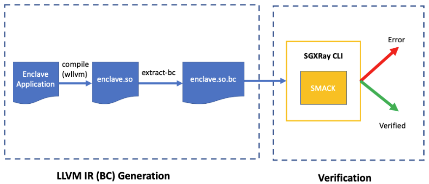

# SGXRay: Automated Vulnerability Finding in SGX Enclave Applications

SGXRay is an automated reasoning tool based on the [SMACK](http://smackers.github.io/) verification toolchain that automatically detects SGX enclave bugs rooting from violations of trusted boundaries. It recompiles a given enclave code and starts the analysis from a user-specified enclave function entry. After the analysis, it either finds an invalid pointer handling inside an SGX software stack such as deferencing unchecked pointer inside an enclave, invalid memory deallocation, and time-of-check to time-of-use bugs, or prove the absense of such bugs up to a user-specified loop and recursion bound.

Currently, SGXRay SGX applications built on two SGX SDKs: Intel SGX SDK and Open Enclave SDK. Users can opt in SDK code for a more thorough analysis.


## Getting Started
For a quick start, please follow a step-by-step tutorial on using SGXRay over one of the demo examples [here](docs/tutorial.md).

The following figure demonstrates the workflow of SGXRay.



Running SGXRay is a two-step process. The first step is to obtain an LLVM IR file for the application.
The second step is to invoke the SGXRay CLI for verification.

For the first step, we provide two Docker images for each SDK, respectively.
```bash
docker pull baiduxlab/sgx-ray-frontend-intel
docker pull baiduxlab/sgx-ray-frontend-oe
```
The detailed instructions to run the first step can be found [here](docs/bc-production.md).

For the second step, we also provide a Docker image.
```bash
docker pull baiduxlab/sgx-ray-distro:latest
```
The detailed instructions to run the second step can be found [here](docs/verification.md).


## Installation
We provide a script `install.sh` that installs SGXRay and its dependencies. Note that Clang-11 is required to get the bc
files of SGX applications so it is not included in this script. Installation of Clang-11 can be done via Debian packages or simply downloading it from LLVM's website.

To install SGXRay from scratch, simply clone this repo and run `sudo ./install.sh` from its root directory. SGXRay will be installed at the `/opt/sgxray` directory. For a rootless installation, please use `./install.sh --prefix <installation-path>`.


### Docker Build
We provide a [Dockerfile](Dockerfile) that builds a image for the verification step.

```bash
git clone https://github.com/baidu/sgxray.git && cd sgxray
docker build . -t sgxray-local
```


## Run SGXRay CLI
Succesful installation using `install.sh` should produce an environment file `sgx.environment` at the installed path.
Source this file and the SGXRay CLI (sgx-ray) should in the path. The `-h` option provides an overview
of SGXRay CLI's option.

For a typical Intel SGX-based application, SGXRay CLI can be invoked as,

```bash
sgx-ray --intel --ecall-name <ecall> <enclave.so.bc>
```

For a typical openenclave-based application, SGXRay CLI can be invoked as,
```bash
sgx-ray --oe --ecall-name <ecall> <enc.bc>
```

We also provide detailed description of this step [here](docs/verification.md).


## Running the tests
The test cases are placed in the `tests` directory. To run them, please refer to the [README](tests/README.md) file.


## Contributing
SGXRay is maintained by Shaobo He (shaobohe@baidu.com). Please submit issues if you have any feature requests or questions about SGXRay. Please create pull requests if you would like to contribute to SGXRay. Similar to SMACK, we adopt the following two simple guidelines for contributors.

* We use this [git branching
  model](http://nvie.com/posts/a-successful-git-branching-model/). Please avoid
  working directly on the `master` branch.
* We follow guidelines for [good git commit
  practice](https://wiki.openstack.org/wiki/GitCommitMessages)

A simple design documentation of SGXRay is [here](docs/design.md). Pelase refer to this file first if you would like to contribute.


## License
SGXRay is Apache V2-licensed. Please refer to [LICENSE](./LICENSE) for details.
